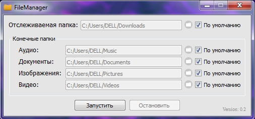
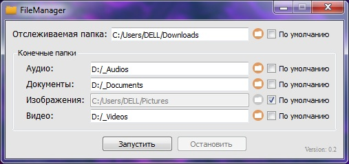
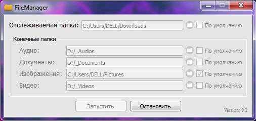

# FileManager
### Описание
Приложение, написанное на языке Python3 и отслеживающее, по задумке, папку загрузок с целью перемещения оттуда файлов определенного формата в другие указанные папки. Например, вы скачиваете картинку и она сразу перемещается из папки загрузок в папку для картинок.

---
Интерфейс создан при помощи фреймворка [PyQt5](https://pypi.org/project/PyQt5/) и инструмента [Designer](https://pypi.org/project/pyqt5-tools/); отслеживающий механизм работает на основе библиотеки [watchdog](https://pypi.org/project/watchdog/). [Упаковано в .exe](https://drive.google.com/open?id=16dDV1Q05__fkd_AHdu3Tl0qH1ufwacsP) при помощи библиотеки [PyInstaller](https://pypi.org/project/PyInstaller/)

---
### Использование
Поле "Отслеживаемая папка" обязательно для заполнения. В остальных полях указать соответствующие папки, либо не указывать ничего. Папки можно указать при помощи ручного ввода, либо нажатия на кнопку  Если в поле ввода указать путь к несуществующей папке, она создастся согласно данному пути. После выполния описанных действий необходимо нажать кнопку "Запустить".
После первого запуска в папке с программой создастся файл config.json, в котором можно отредактировать папки, стоящие по умолчанию, а также добавить новые расширения, по которым будут производиться определения типов файлов.

---
### Скриншоты

---

---

